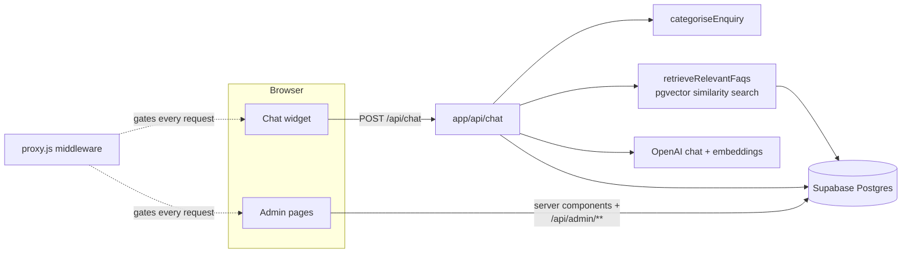
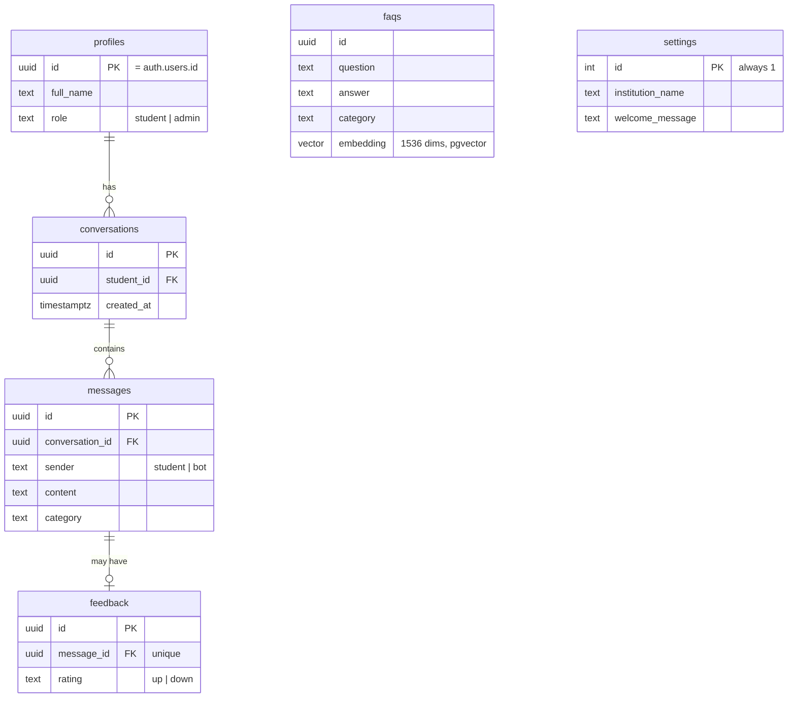

# DELSU Student Enquiry System

**Design and Implementation of a Context-Aware Student Enquiry Chatbot with
Analytics-Driven Decision Support System** — a B.Sc. Computer Science
final-year project built as a realistic MVP, not a toy demo.

Prospective and current students get instant, accurate answers to
admissions, fees, deadlines, registration, and results questions from a
chatbot grounded in the institution's own approved knowledge base — not the
AI's general training data, and not guesses. Administrators get a live
analytics dashboard that turns every one of those conversations into
decision-support data: what students are actually asking about, how often,
and whether the answers were helpful.

## What it does

**For students**
- Chat with no account required (anonymous "prospective student" mode) —
  or log in for a saved conversation **History** and a **Profile**.
- Every answer is retrieved from an approved FAQ knowledge base via
  Retrieval-Augmented Generation (RAG) — embeddings + cosine similarity,
  not keyword search and not the AI improvising.
- **Context-aware**: a follow-up like "what about the deadline?" is
  understood using the conversation so far, not treated as a fresh question.
- Rate any reply (👍/👎) with an optional comment.
- Works on desktop and mobile — the whole UI, including the sidebar
  navigation, is responsive.

**For administrators**
- **Analytics dashboard**: total enquiries, active users, knowledge-base
  size, and feedback — plus charts for enquiry categories and daily trends,
  all computed live from real data (no placeholders).
- **Enquiry browser**: read any student's conversation.
- **Knowledge-base editor**: add/edit/delete FAQs; each is automatically
  re-embedded so the chatbot can use it immediately.
- **User management**: create student or admin accounts (there's no public
  sign-up — access is admin-controlled).
- **Settings**: change the institution name and the chatbot's welcome
  message without touching code.

## Why it's built this way

The technology choices below were made deliberately, not by default —
see the sections that follow for the reasoning behind each one:

| Layer | Choice | Why (short version) |
|---|---|---|
| Frontend + backend | Next.js (App Router) + Material UI | One codebase for the UI, API routes, and role-gated middleware — see [Why Next.js](#why-nextjs-instead-of-vanilla-htmlcssjs) |
| Database | Supabase (Postgres) + pgvector | Managed Postgres, auth, and vector search in one place — see [Why Supabase](#why-supabase-instead-of-fastapi--postgresql--sqlalchemy) |
| AI | OpenAI (embeddings + chat) | text-embedding-3-small for retrieval, a cheap chat-completion model for replies |
| Hosting | Vercel | Ships the frontend, API routes, and edge middleware as one deployment |

Full technical documentation — architecture diagrams, the database schema,
UML design, API reference, and the testing/evaluation plan — is in the
sections below and in [docs/DESIGN.md](docs/DESIGN.md) and
[docs/TESTING.md](docs/TESTING.md). A formatted project write-up (PDF and
Word) covering the same ground is in
[docs/PROJECT_WRITEUP.pdf](docs/PROJECT_WRITEUP.pdf).

## Table of contents

- [What it does](#what-it-does)
- [Why it's built this way](#why-its-built-this-way)
- [Why Next.js instead of vanilla HTML/CSS/JS](#why-nextjs-instead-of-vanilla-htmlcssjs)
- [Why Supabase instead of FastAPI + PostgreSQL + SQLAlchemy](#why-supabase-instead-of-fastapi--postgresql--sqlalchemy)
- [Architecture](#architecture)
- [Data model](#data-model)
- [Roles & authentication](#roles--authentication)
- [Route map](#route-map)
- [API reference](#api-reference)
- [Setup](#setup)
- [Deployment (Vercel)](#deployment-vercel)
- [Automated tests](#automated-tests)
- [Troubleshooting](#troubleshooting)
- [Design documentation](docs/DESIGN.md) — use-case, activity, sequence & class diagrams
- [Testing & evaluation](docs/TESTING.md) — functional test cases + performance metrics
- [Requirements checklist](#requirements-checklist)
- [Notes for extending this project](#notes-for-extending-this-project)

## Why Next.js instead of vanilla HTML/CSS/JS

This project needs client-side interactivity (a live chat widget), two
authenticated areas with different permissions (student vs admin), and a
backend that talks to a database and an AI model. Next.js gives us all of
that in one framework:

- **File-based routing** -- `app/admin/dashboard/page.js` is automatically
  the `/admin/dashboard` route. No router library needed.
- **API routes** -- `app/api/chat/route.js` is a real backend endpoint,
  running on the server, right next to the frontend code. This replaces the
  FastAPI service from the original project spec.
- **Server components** -- pages like the dashboard fetch data directly on
  the server (fast, and keeps secret keys off the browser) without a
  separate "load data then render" step.
- **Middleware (`proxy.js`)** -- runs before every request to decide, in one
  place, who's allowed to see what (see [Roles & authentication](#roles--authentication)).
- **One deployable unit** -- ship to Vercel (or any Node host) as a single
  app, instead of coordinating a static frontend + separate API server.

Vanilla HTML/CSS/JS would still require hand-building routing, auth-state
handling, and a separate backend for the database/AI calls -- more code for
the same result.

## Why Supabase instead of FastAPI + PostgreSQL + SQLAlchemy

Supabase **is** managed PostgreSQL, plus things we'd otherwise have to build
ourselves:

| Original spec | Supabase equivalent |
|---|---|
| PostgreSQL | Supabase Postgres (same database, hosted) |
| SQLAlchemy | Supabase's JS client (`@supabase/supabase-js`) |
| FastAPI-based authentication | Supabase Auth (student **and** admin accounts) |
| ChromaDB (separate vector store) | **pgvector** extension, built into the same Postgres database |

The knowledge base's text AND its embeddings live in the same table, in the
same database, queried with plain SQL -- no separate vector database to run
or keep in sync.

## Architecture



Every enquiry is stored, so the same data that answers the student also
feeds the admin dashboard:

```mermaid
flowchart LR
    Enquiry[Student message] --> Messages[(messages table)]
    Messages --> CategoryChart[get_category_counts\n\"Top Enquiry Topics\"]
    Messages --> DailyChart[get_daily_enquiry_counts\n\"Enquiry Trends\"]
    Messages --> Enquiries[get_recent_conversations\nAdmin \/ Enquiries page]
    Feedback[Thumbs up/down] --> FeedbackTable[(feedback table)]
    FeedbackTable --> FeedbackStat[get_feedback_counts\nDashboard stat card]
```

Key files:

- [`lib/supabase/`](lib/supabase) -- four different Supabase clients, each
  used in the right place: `client.js` (browser, publishable key),
  `server.js` (server components/route handlers, reads the visitor's own
  session from cookies), `admin.js` (secret key, bypasses RLS -- the only
  place the app reads/writes application data), `middleware.js` (used by
  `proxy.js` to refresh sessions and redirect by role).
- [`lib/auth/requireUser.js`](lib/auth/requireUser.js) /
  [`lib/auth/requireAdmin.js`](lib/auth/requireAdmin.js) -- API route guards.
  `requireUser` accepts any logged-in account; `requireAdmin` additionally
  checks `role === "admin"`.
- [`lib/ai/openai.js`](lib/ai/openai.js) -- the only file that calls the AI
  provider (embeddings + chat replies).
- [`lib/ai/rag.js`](lib/ai/rag.js) -- Retrieval-Augmented Generation: looks
  up relevant knowledge-base entries before answering.
- [`lib/ai/classify.js`](lib/ai/classify.js) -- simple keyword-based
  categorisation, used for the analytics dashboard.
- [`app/api/chat/route.js`](app/api/chat/route.js) -- the main chatbot
  endpoint; context-awareness, RAG, and storage all come together here.
- [`supabase/schema.sql`](supabase/schema.sql) +
  [`supabase/schema_v2_student_accounts.sql`](supabase/schema_v2_student_accounts.sql)
  -- every table, index, and SQL function the app needs, fully commented.

## Data model



`profiles.id` is the same uuid as the Supabase Auth user's id (`auth.users.id`)
-- `profiles` just mirrors the account's name/role into a normal table so the
rest of the app can query/join it with plain SQL instead of calling the Auth
admin API every time.

## Roles & authentication

There is **one** login page (`/login`) for both students and admins --
after signing in, the account's `role` (stored in its Supabase Auth
`user_metadata`, set when the account is created) decides where it lands and
what it can reach:

| Route prefix | Who can access it | Enforced by |
|---|---|---|
| `/`, `/login` | Everyone | n/a |
| `/chat`, `/history`, `/profile` | Any logged-in account | `proxy.js` (redirects to `/login`) |
| `/admin/**` | Accounts with `role: "admin"` only | `proxy.js` (redirects to `/login`) |
| `/api/chat`, `/api/feedback` | Any logged-in account | `requireUser()` (401 JSON) |
| `/api/faqs`, `/api/admin/**` | Admins only | `requireAdmin()` (401 JSON) |

Two layers on purpose: `proxy.js` gives visitors a clean redirect when they
land on a page directly; the API routes check again because they can also be
called directly (not just from the page that normally calls them).

**There is no public sign-up page.** New accounts (student or admin) are
created by an existing admin, from **Admin → Users** -- see
[Setup](#setup) for how to create the very first admin account, since that
page itself requires being logged in as one already.

## Route map

| Route | Renders | Notes |
|---|---|---|
| `/` | Landing page | Public. "Start Chat" / "Login" both require an account to actually chat. |
| `/login` | Sign in | Public. Redirects signed-in visitors to `/chat` or `/admin/dashboard` by role. |
| `/chat` | Chat widget | Student sidebar layout (Chat / History / Profile / Logout). |
| `/history` | List of the student's own past conversations | |
| `/history/[id]` | Read-only transcript of one conversation | 404s if it isn't yours. |
| `/profile` | Name, email, role, member-since date | |
| `/admin/dashboard` | 4 stat cards + 2 charts | Admin sidebar layout. |
| `/admin/enquiries` | Table of recent conversations | |
| `/admin/enquiries/[id]` | Read-only transcript, any student | |
| `/admin/knowledge-base` | FAQ CRUD (auto-embeds on save) | |
| `/admin/users` | Create/list/delete accounts | Shows a generated temp password once, on creation. |
| `/admin/settings` | Institution name + chatbot welcome message | Feeds live into `/chat` and the AI system prompt. |

## API reference

All routes return JSON. Error responses are `{ "error": "..." }`.

### `POST /api/chat`
Auth: any logged-in account. Body: `{ conversationId?: string, message: string }`.
Response: `{ conversationId, reply, replyMessageId }`. Creates a conversation
on the first message (tied to the caller), categorises the message, runs
RAG against the knowledge base, and asks the LLM for a reply using recent
history for context.

### `POST /api/feedback`
Auth: any logged-in account. Body: `{ messageId: string, rating: "up" | "down" }`.
Upserts a rating for that bot message (one rating per message).

### `GET|POST|PUT|DELETE /api/faqs`
Auth: admin. `GET` lists all FAQs. `POST { question, answer, category? }` /
`PUT { id, question, answer, category? }` create/update an entry and embed
it. `DELETE { id }` removes one.

### `GET|POST|DELETE /api/admin/users`
Auth: admin. `GET` lists every account. `POST { email, fullName, role }`
creates one and returns a one-time `tempPassword`. `DELETE { id }` removes
an account.

### `GET|PUT /api/admin/settings`
Auth: admin. `GET` returns the single settings row. `PUT { institutionName, welcomeMessage }` updates it.

## Setup

### 1. Create a Supabase project

Go to [supabase.com](https://supabase.com), create a free project, then open
**SQL Editor** and run, in order:

1. [`supabase/schema.sql`](supabase/schema.sql) -- enables `pgvector`,
   creates `conversations`, `messages`, `faqs`.
2. [`supabase/schema_v2_student_accounts.sql`](supabase/schema_v2_student_accounts.sql)
   -- adds `profiles`, `feedback`, `settings`, and the analytics functions
   the new admin pages use.

### 2. Get an OpenAI API key

Create a key at [platform.openai.com](https://platform.openai.com/api-keys).
Used for both chat replies and the embeddings that power search.

### 3. Configure environment variables

```bash
cp .env.local.example .env.local
```

Fill in all four values (Supabase project URL + publishable key + secret
key, all under **Project Settings → API**; and your OpenAI key).

### 4. Install and run

```bash
npm install
npm run dev
```

Open [http://localhost:3000](http://localhost:3000).

### 5. Create your first admin account

There's no public sign-up page, and the in-app **Users** page requires
being logged in as an admin already -- so the first one is created by hand,
**once**. Full instructions (with the exact SQL) are at the bottom of
[`supabase/schema_v2_student_accounts.sql`](supabase/schema_v2_student_accounts.sql).
Short version:

1. Supabase dashboard → **Authentication → Users → Add user** (tick "Auto confirm user").
2. Run the two `update` statements at the bottom of that SQL file, with your email.
3. Log in at `/login` -- you'll land on `/admin/dashboard`.

From then on, create every other account (students included) from
**Admin → Users**.

### 6. Add knowledge base entries

Go to **Admin → Knowledge Base** and add real Q&A pairs (admission
requirements, fees, deadlines, etc). The chatbot can only answer accurately
using what's added here -- that's the whole point of RAG: it grounds
answers in approved information instead of the AI's general knowledge.

## Deployment (Vercel)

1. Push this repo to GitHub (or run `vercel` from this folder to deploy
   directly without a git remote).
2. In the Vercel project's **Settings → Environment Variables**, add the
   same four variables from `.env.local` (Production **and** Preview).
3. Deploy. Vercel builds with `next build` and serves `proxy.js` as edge
   middleware automatically -- no extra configuration needed.

## Automated tests

```bash
npm test
```

Runs the [Vitest](https://vitest.dev) suite in `lib/**/*.test.js`. These are
plain Node-side unit tests for the logic that doesn't need a live database
or a browser -- no test database, no mocked HTTP server:

- `lib/ai/classify.test.js` -- every category the keyword classifier
  supports, case-insensitivity, and the "general" fallback.
- `lib/ai/rag.test.js` -- `buildContextBlock`'s formatting, plus
  `retrieveRelevantFaqs` with a mocked Supabase RPC and a mocked OpenAI
  embedding call (so it never makes a real network request).
- `lib/auth/requireAdmin.test.js` / `requireUser.test.js` -- the exact
  role-checking gap these guards exist to close (logged-in ≠ admin),
  with `lib/supabase/server` mocked.
- `lib/ai/openai.test.js` -- a regression test for the lazy-client-construction
  fix (a missing `OPENAI_API_KEY` used to crash the whole route module at
  import time; it shouldn't).

What this suite does **not** cover: React components, the Next.js API
routes end-to-end, or anything that needs a real Supabase/OpenAI call --
those are exercised manually (see [Testing & evaluation](docs/TESTING.md)
for the functional test-case checklist covering that ground instead).

## Troubleshooting

- **"Supabase is not configured yet" on `/admin/*` or `/chat`** --
  `.env.local` is missing the Supabase URL/publishable key. Public pages
  (`/`, `/login`) still work; see [Setup](#setup) step 3.
- **A page 500s with a blank body** -- almost always a missing
  `OPENAI_API_KEY` or `SUPABASE_SECRET_KEY`. Check the terminal running
  `next dev` for the real error (API responses intentionally hide details
  from the browser).
- **Logged in but bounced back to `/login`** -- the account's `role` isn't
  set to `"admin"` (for `/admin/**`) or the session cookie didn't refresh.
  Check `raw_user_meta_data` on that user in Supabase → Authentication.
- **A new FAQ never gets used by the chatbot** -- its embedding may have
  failed to generate (bad/missing `OPENAI_API_KEY` at the time it was
  saved). Re-save it once the key is configured.

## Requirements checklist

- ✅ Chat interface for students (`app/(student)/chat` + `components/ChatWidget.js`)
- ✅ NLP-based intent understanding (delegated to the language model, guided
  by retrieved knowledge-base context)
- ✅ Context-aware follow-ups (recent conversation history sent with every
  request -- see `HISTORY_LENGTH` in `app/api/chat/route.js`)
- ✅ RAG against an approved knowledge base (`lib/ai/rag.js` + `match_faqs` SQL function)
- ✅ Conversation/message storage (`conversations` + `messages` tables)
- ✅ Enquiry categorisation (`lib/ai/classify.js`)
- ✅ Student accounts with saved History and a Profile page
- ✅ Reply feedback (thumbs up/down, surfaced on the dashboard)
- ✅ Admin knowledge-base management (`app/admin/knowledge-base`)
- ✅ Admin enquiry browser (`app/admin/enquiries`)
- ✅ Admin user management (`app/admin/users`)
- ✅ Admin-editable settings (`app/admin/settings`)
- ✅ Analytics dashboard with 4 stat cards + charts (`app/admin/dashboard` + Chart.js)
- ✅ Role-based authentication gating every protected route (`proxy.js` + Supabase Auth)

## Notes for extending this project

- The categoriser is intentionally simple (keyword matching). A stronger
  version could ask the language model to classify each enquiry instead.
- New accounts get a generated temporary password shown once in the Users
  page. For a real deployment, swap this for Supabase's `inviteUserByEmail`
  (requires configuring an email provider in the Supabase dashboard) so
  students get an email instead of a password relayed by an admin.
- To reduce OpenAI cost/latency further, you could cache embeddings for
  repeated/near-duplicate questions.
- History currently shows a read-only transcript; resuming an old
  conversation (continuing to chat within it) would need `/chat` to accept
  a `?conversation=id` and load that history before the first send.
