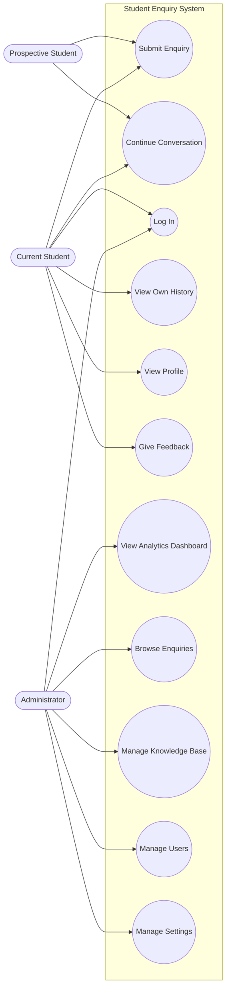
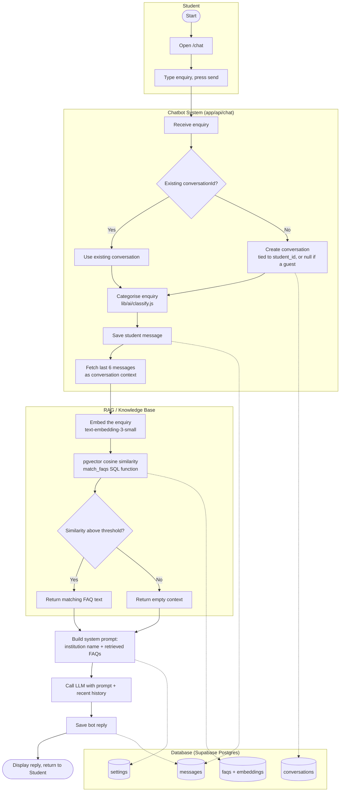
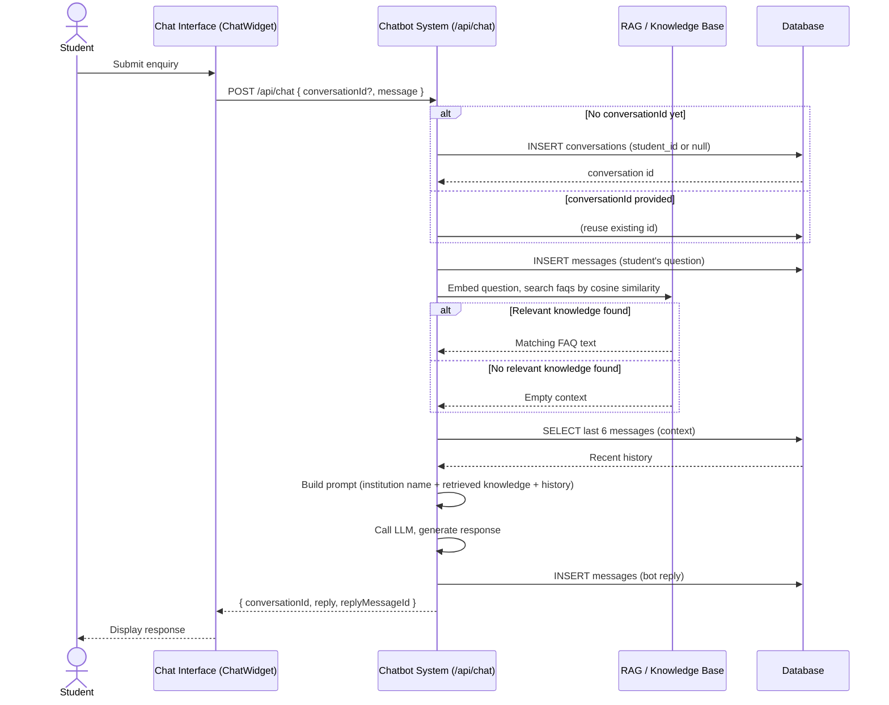
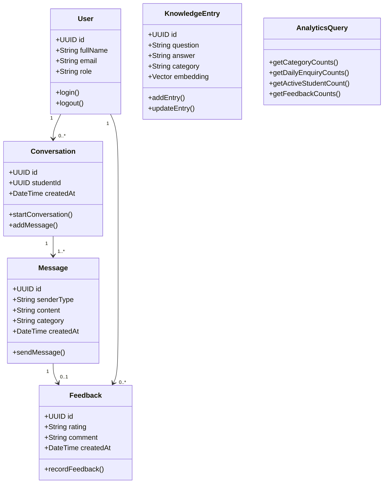

# Design documentation

This file covers the UML-style diagrams the project spec asks for that
weren't already in the main [README](../README.md) (which has the
[system architecture](../README.md#architecture) and
[ERD](../README.md#data-model) diagrams). Everything here reflects what's
**actually implemented** in this codebase — not an idealised version of the
spec. Where this system's design genuinely differs from the spec's suggested
shape (see the note on the class diagram), that's called out rather than
faked.

## Use-case diagram

Three actors, matching the roles the code actually enforces (see
[Roles & authentication](../README.md#roles--authentication)):

Internal technical steps (generate embedding, cosine similarity search,
call the LLM) are deliberately **not** use cases — they're implementation
detail behind "Submit Enquiry", not user goals.

### Use-case descriptions

| Use case | Actor(s) | Precondition | Main flow | Postcondition |
|---|---|---|---|---|
| Submit Enquiry | Prospective, Current Student | On `/chat` | Type a question, press send | Message + reply stored; reply shown |
| Continue Conversation | Prospective, Current Student | Already submitted at least one enquiry in this session | Ask a follow-up | Recent messages are included as context (see `HISTORY_LENGTH` in `app/api/chat/route.js`) |
| Log In | Current Student, Admin | Has an account (created by an admin) | Enter email + password on `/login` | Redirected to `/chat` (student) or `/admin/dashboard` (admin) |
| View Own History | Current Student | Logged in | Open `/history` | List of own past conversations; click one for the transcript |
| View Profile | Current Student | Logged in | Open `/profile` | Name, email, role, academic details shown |
| Give Feedback | Current Student | Logged in, viewing a bot reply | Click thumbs up/down, optionally add a comment | Row written to `feedback`, reflected in the admin dashboard's Feedback stat |
| View Analytics Dashboard | Admin | Logged in as admin | Open `/admin/dashboard` | Stat cards + charts computed from real `messages`/`feedback` data |
| Browse Enquiries | Admin | Logged in as admin | Open `/admin/enquiries` | Table of recent conversations; click one for the transcript |
| Manage Knowledge Base | Admin | Logged in as admin | Add/edit/delete an FAQ on `/admin/knowledge-base` | Entry (re-)embedded and immediately usable by RAG |
| Manage Users | Admin | Logged in as admin | Create/delete an account on `/admin/users` | New account (student or admin) created with a one-time temp password |
| Manage Settings | Admin | Logged in as admin | Edit institution name / welcome message on `/admin/settings` | Both take effect immediately in `/chat` and the AI system prompt |

## Activity diagram

Swimlanes matching the actual code path in `app/api/chat/route.js`:

## Sequence diagram

## Class diagram

> **Deviation from the spec's suggested shape, and why:** the spec's
> `KnowledgeDocument` → `DocumentChunk` split assumes long documents get
> split into multiple chunks. This system's actual knowledge base is
> FAQ-entry based (`faqs` table) — each entry is short enough to embed as a
> single vector directly, with no chunking step. Modelling a `DocumentChunk`
> class that doesn't exist in the code would misrepresent the
> implementation, so `KnowledgeEntry` below maps onto the real `faqs` table
> instead.

`AnalyticsQuery` isn't a persisted entity -- it represents the SQL functions
in `supabase/schema.sql` / `schema_v2_student_accounts.sql` that the admin
dashboard calls; included here because it's a real, named part of the
implementation, not to pad the diagram.
